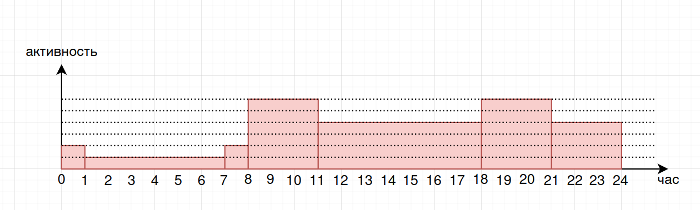

# ВКонтакте

---

## 1. Тема и целевая аудитория

### Тема

**ВКонтакте** - социальная сеть, предназначенная для обмена сообщениями между пользователями.
Кроме того имеет такой функционал, как добавление в друзья, формирование и просмотр ленты.

### MVP

* Регистрация и авторизация пользователей
* Профиль пользователя
* Поиск людей
* Добавление в друзья
* Обмен сообщениями (создание, редактирование, удаление) в личной беседе
* Просмотр ленты (лента формируется из постов, созданных друзьями пользователя)
* Комментарии под постами

**Посты, выкладываемые в ленте могут иметь формат:**

* фотографии
* видеофайлы
* аудиозаписи
* текстовый формат

Функционал добавления в друзья имеет вид взаимной дружбы (если один человек находится в друзьях у другого,
то и другой находится в друзьях у первого). В ленте пользователь видит только те посты, которые опубликовали
друзья пользователя.

### Целевая аудитория

* Международная месячная аудитория 101,7 млн пользователей
* Дневная аудитория 53,6 пользователей
* 15 млрд сообщений в день

#### Распределение пользователей по странам:

| Страна    | %     | чел, млн |
|-----------|-------|----------|
| Россия    | 83,59 | 85,01    |
| Беларусь  | 3,13  | 3,18     |
| Казахстан | 2,30  | 2,34     |
| Украина   | 1,26  | 1,28     | 
| Германия  | 0,96  | 0,98     |
| Другое    | 8,76  | 8,91     |

---

## 2. Расчет нагрузки

### Продуктовые метрики

* Месячная аудитория 101,7 млн
* Дневная аудитория 53,6 млн
* 15 млрд сообщений в день

#### Усредненные метрики

1. Регистрация:

```
Аудитория ВКонтакте растет в среднем на 32% каждый год
   
Аудитория в 2023 году - 101,7 млн, в 2022 на 32% меньше, ~77 млн
   
Прирост аудитории за год - 25 млн
   
RPS: 25*10^6 чел / (365 д * 24 ч * 60 м * 60 с) = 0,8 
```

2. Авторизация:

```
Дневная аудитория ВК: 53,6 млн
   
Обычно пользователь авторизуется раз в 3 месяца (4 раза в год), получает куку и далее использует её.
   
RPS: 53,6*10^6 чел * 4 / (365 д * 24 ч * 60 м * 60 с) = 6,8
```

3. Изменение профиля:

```
Самое частое изменение профиля связано с изменением фото профиля.
Фото меняют обычно 2 раза в год.

RPS: 53,6*10^6 чел * 2 / (365 д * 24 ч * 60 м * 60 с) = 3,4
```

4. Поиск людей:

```
Поиск людей (в том числе и поиск среди друзей для того, чтобы найти старый чат, уехавший вниз в списке чатов)
люди осуществляют раз в неделю (52 раза в год).

RPS: 53,6*10^6 чел * 52 / (365 д * 24 ч * 60 м * 60 с) = 88,4
```

5. Добавление в друзья:

```
В среднем у человека в друзьях находится 100 человек, которых он добавляет в течении жизни своего профиля.
Средняя продолжительность жизни профиля ВК около 7 лет.

RPS: 53,6*10^6 чел / (7 лет * 365 д * 24 ч * 60 м * 60 с) = 0,2

Удаление из друзей происходит крайне редко, поэтому рассматривать его не будем.
```

6. Создание текстовых сообщений:

```
В день сообщений: 15 млрд
   
RPS: 15*10^9 сбщ / (24 ч * 60 м * 60 с) = 174 тыс
```

7. Создание голосовых сообщений:

```
В день сообщений: 15 млрд
Голосовые сообщения в среднем занимают 1% от общего числа сообщений
   
RPS: 15*10^9 сбщ * 1% / (24 ч * 60 м * 60 с) = 1,74 тыс
```

8. Создание сообщений с вложениями:

```
В день сообщений: 15 млрд
Сообщения с вложениями в среднем занимают 5% от общего числа сообщений
   
RPS: 15*10^9 сбщ * 5% / (24 ч * 60 м * 60 с) = 8,7 тыс
```

9. Редактирование сообщения:

```
В среднем редактируется около 10% сообщений
   
RPS: 174*10^3 сбщ * 10% = 17,4 тыс
```

10. Удаление сообщения:

```
В среднем удаляется около 1% сообщений
   
RPS: 174*10^3 сбщ * 1% = 1,74 тыс
```

11. Просмотр сообщений:

```
Каждый пользователь в среднем просматривает около 200 сообщений в день.
   
RPS: 53,6*10^6 чел * 200 сбщ / (24 ч * 60 м * 60 с) = 124 тыс
```

12. Просмотр голосовых сообщений:

```
Голосовые сообщения в среднем занимают 1% от общего числа сообщений
   
RPS: 124 тыс * 1% = 1,24 тыс
```

13. Просмотр сообщений с вложениями:

```
Сообщения с вложениями в среднем занимают 5% от общего числа сообщений
Каждый пользователь в среднем просматривает около 200 сообщений в день.

RPS: 53,6*10^6 чел * 200 сбщ * 5% / (24 ч * 60 м * 60 с) = 6,2 тыс
```

14. Получение списка диалогов:

```
В среднем каждый человек заходит в ВК 15 раз в день. 
При этом необходимо каждый раз получать список диалогов.

RPS: 53,6*10^6 чел * 15 / (24 ч * 60 м * 60 с) = 9,3 тыс
```

15. Создание постов:

```
Каждый человек в среднем выкладывает 1 пост раз в 2 недели (21 раз в год).
   
RPS: 53,6*10^6 чел * 21 / (24 ч * 60 м * 60 с) = 13 тыс
```

16. Просмотр ленты:

```
Каждый человек в среднем заходит 5 раз в день в ленту.

RPS: 53,6*10^6 чел * 5 / (24 ч * 60 м * 60 с) = 3,1 тыс
```

17. Просмотр поста:

```
В среднем у каждго человека в друзьях 100 человек.
Каждый человек в среднем выкладывает 1 пост раз в 2 недели (21 раз в год).
Лента формируется из постов друзей пользователя.
Тогда количество постов в ленте у одного человека в день - 100 чел / 14 д = 7,1 постов
При таком количестве постов в течении дня пользователь просматривает их все.

RPS: 53,6*10^6 чел * 7,1 пст / (24 ч * 60 м * 60 с) = 4,4 тыс 
```

18. Создание комментариев:

```
Под каджым постом создается около 5 комментариев.
RPS на создание поста - 13 тыс.

RPS: 13000 * 5 = 65 тыс
```

19. Просмотр комментариев:

```
RPS на просмотр постов = 4,4 тыс.
Обычно пользователь просматривает пост вместе со всеми комментариями.

RPS: 4,4 тыс
```

20. Поход за статикой

```
Кэш в браузее обычно обновляется раз в неделю
Дневная аудитория 53,6 пользователей
Когда в кэше пользователя не лежит статика (html, css, js), отправляется запрос на сервер

RPS: 53,6*10^6 чел / (7 д * 24 ч * 60 м * 60 с) = 88,6
```

#### Сводная таблица RPS по типовым действиям

| №  | Действие                        |  Тип   |   RPS    | RPD (x86400) |
|:--:|---------------------------------|:------:|:--------:|:------------:|
| 1  | Регистрация                     | Запись |   0,8    |    69 тыс    |
| 2  | Авторизация                     | Чтение |   6,8    |   588 тыс    |
| 3  | Изменение профиля               | Запись |   3,4    |   294 тыс    |
| 4  | Поиск людей                     | Чтение |   88,4   |   7,6 млн    |
| 5  | Добавление в друзья             | Запись |   0,2    |    17 тыс    |
| 6  | Создание текстовых сообщений    | Запись | 174 тыс  |   15 млрд    |
| 7  | Создание голосовых сообщений    | Запись | 1,74 тыс |   150 млн    |
| 8  | Создание сообщений с вложениями | Запись | 8,7 тыс  |   752 млн    |
| 9  | Редактирование сообщения        | Запись | 17,4 тыс |   1,5 млрд   |
| 10 | Удаление сообщения              | Запись | 1,74 тыс |   150 млн    |
| 11 | Просмотр сообщений              | Чтение | 124 тыс  |   11 млрд    |
| 12 | Просмотр голосовых сообщений    | Чтение | 1,24 тыс |   110 млн    |
| 13 | Просмотр сообщений с вложениями | Чтение | 6,2 тыс  |   536 млн    |
| 14 | Получение списка диалогов       | Чтение | 9,3 тыс  |   803 млн    |
| 15 | Создание постов                 | Запись |  13 тыс  |   1,1 млрд   |
| 16 | Просмотр ленты                  | Чтение | 3,1 тыс  |   268 млн    |
| 17 | Просмотр поста                  | Чтение | 4,4 тыс  |   380 млн    |
| 18 | Создание комментариев           | Запись |  65 тыс  |   5,6 млрд   |
| 19 | Просмотр комментариев           | Чтение | 4,4 тыс  |   380 млн    |
| 20 | Поход за статикой               | Чтение |   88,6   |   7,7 млн    |

### Технические метрики

**Информация о пользователе:**

```
Несмотря на все важные текстовые поля, фото будет весить намного больше, поэтому будем учитывать только его.
Аватарка: 50 Кбайт;

Итого: 50 Кб
```

**Информация о сообщении**

```
id: 16 байт (UUID);
Текст: Примем, что в среднем 1 сообщение содержит 50 символов. 
       1 символ в Unicode кодируется 2 байтами.
Голос: В среднем длительность голосового сообщения - 10 сек.
       1 сек голосового кодируется примерно 20 Кб
       Общий вес - 200 Кб 
Вложение: 5 Мб в среднем (1 фото)
Дата создания: 4 байта (timestamp)
Дата редактирования: 4 байта (timestamp)
id диалога: 16 байт (UUID);

Текстовые данные о сообщении будут важны только при условии, что сообщение будет текстовое.
В остальных случаях другие поля учитывать не будем.

Текстовое сообщение: 16 + 50*2 + 4 + 4 + 16 = 140 б
Голосовое сообщение: 200 Кб
Сообщение с вложением: 5 Мб
```

**Информация о комментарии**

```
id: 16 байт (UUID);
Текст: Примем, что в среднем 1 комментарий содержит 50 символов. 
       1 символ в Unicode кодируется 2 байтами.
Дата создания: 4 байта (timestamp)
id поста: 16 байт (UUID);

Итого: 16 + 50*2 + 4 + 16 = 136 б
```

**Информация о посте**

```
id: 16 байт (UUID);
Текст: Примем, что в среднем 1 комментарий содержит 50 символов. 
       1 символ в Unicode кодируется 2 байтами.
Вложение: 5 Мб в среднем (1 фото)
Дата создания: 4 байта (timestamp)
Комментарии: в среднем 5 штук по 120 б

Текстовые данные о сообщении будут важны только при условии, что пост будет текстовым.
В случаяе поста с вложением другие поля, кроме вложения, учитывать не будем.

Текстовый пост: 16 + 50*2 + 4 + 4 = 124 б
Пост с вложением: 5 Мб
```

**Информация о диалоге**

```
id: 16 байт (UUID);
id одного пользователя: 16 байт (UUID);
id второго пользовател: 16 байт (UUID);
Дата создания: 4 байта (timestamp)

Итого: 16 + 50*2 + 4 = 120 б
```

С момента создания ВК прошло 17 лет. С того момента было зарегистрировано 500 млн аккаунтов.

1. Профили пользователей:

```
Общий объем хранилица: 500*10^6 акк * 50 Кб = 25 Тб
Общий объем памяти за год: 25 Тб / 17 л = 1,47 Тб
Общий объем памяти за квартал: 368 Гб
```

2. Создание текстовых сообщений:

```
В день сообщений: 15 млрд

Общий объем памяти в день: 15*10^9 * 140 = 2,1 Тб
Общий объем памяти за квартал: 2,1 Тб * 30 д * 3 мес = 189 Тб
Общий объем памяти за год: 2,1 Тб * 365 д = 767 Тб
Общий объем памяти за все время: 767 Тб * 17 л = 13 Пб
```

3. Создание голосовых сообщений:

```
В день сообщений: 15 млрд
Голосовые сообщения в среднем занимают 1% от общего числа сообщений
Голосовые сообщения в ВК появились в 2016 году (7 лет назад)

Общий объем памяти в день: 15*10^9 * 1% * 200 Кб = 30 Тб
Общий объем памяти за квартал: 30 Тб * 30 д * 3 мес = 2,7 Пб
Общий объем памяти за год: 30 Тб * 365 д = 11 Пб
Общий объем памяти за все время: 11 Пб * 7 л = 77 Пб
```

4. Создание сообщений с вложениями:

```
В день сообщений: 15 млрд
Сообщения с вложениями в среднем занимают 5% от общего числа сообщений

Для хранения на серверах и передачи через сеть, изображение будет сжиматься с 
использованием алгоритмов оптимизации и сжатия. В результате, средний вес сжатой 
картинки составит примерно 500 Кб.

Общий объем памяти в день: 15*10^9 * 5% * 500 Кб = 380 Тб
Общий объем памяти за квартал: 380 Тб * 30 д * 3 мес = 34 Пб
Общий объем памяти за год: 380 Тб * 365 д = 139 Пб
Общий объем памяти за все время: 139 Пб * 17 л = 2360 Пб
```

5. Создание комментариев:

```
Дневная аудитория 53,6 млн.
Каждый человек в среднем выкладывает 1 пост раз в 2 недели (14 дней).
 
Кажды пост имеет в среднем 5 комментариев
   
Общий объем памяти в день: 53,6*10^6 чел / 14 дней * 5 * 136 б = 2,6 Гб
Общий объем памяти за квартал: 2,6 Гб * 30 д * 3 мес = 234 Гб
Общий объем памяти за год: 2,6 Гб * 365 д = 949 Гб
Общий объем памяти за все время: 949 Гб * 17 л = 16 Тб
```

6. Создание постов:

```
Дневная аудитория 53,6 млн.
Каждый человек в среднем выкладывает 1 пост раз в 2 недели (14 дней).

По сравнению с постами с фотографиями, текстовые посты имеют много меньший вес, 
посты с видео (вес которых больше) выкладываются реже, поэтому для усреднения будем считать, 
что каждый пост имеет вес 1 фото (в среднем 5 Мб).
  
Общий объем памяти в день: 53,6*10^6 чел / 14 дней * (5 Мб + 5 * 136 б) = 19 Тб
Общий объем памяти за квартал: 19 Тб * 30 д * 3 мес = 1,7 Пб
Общий объем памяти за год: 19 Тб * 365 д = 6,94 Пб
Общий объем памяти за все время: 6,94 Пб * 17 л = 119 Пб
```

7. Создание диалога:

```
С момента создания ВК было зарегистрировано 500 млн аккаунтов.
Каждый имеет в друзьях примерно 100 человек.
Поскольку дружба ВК взаимная, необходимо делить пополам общее число записей о друзьях.
Количество диалогов можно считать равным числу друзей.

Общее количество записей: 500*10^6 * 100 / 2 * 120 б = 3 Тб
Общий объем памяти за год: 3 Тб / 17 л = 176 Гб
Общий объем памяти за квартал: 176 Гб / 4 = 44 Гб
```

| № | Действие                        | Объем памяти за все время | Объем памяти за квартал | Объем памяти за год |
|:-:|---------------------------------|:-------------------------:|:-----------------------:|:-------------------:|
| 1 | Профили пользователей           |           25 Тб           |         368 Гб          |       1,47 Тб       |
| 2 | Создание текстовых сообщений    |           13 Пб           |         189 Тб          |       767 Тб        |
| 3 | Создание голосовых сообщений    |           77 Пб           |         2,7 Пб          |        11 Пб        |
| 4 | Создание сообщений с вложениями |          2360 Пб          |          34 Пб          |       139 Пб        |
| 5 | Создание комментариев           |           16 Тб           |         234 Гб          |       949 Гб        |
| 6 | Создание постов                 |          119 Пб           |         1,7 Пб          |       6,94 Пб       |
| 7 | Создание диалога                |           3 Тб            |          44 Гб          |       176 Гб        |

### Сетевой трафик

1. Регистрация:

```
0,8 * 50,4 Кб = 40,3 Кб/с
```

2. Авторизация:

```
6,8 * 50,4 Кб = 343 Кб/с
```

3. Изменение профиля:

```
3,4 * 50,4 Кб = 171 Кб/с
```

4. Поиск людей:

```
88,4 * 50,4 Кб = 4,5 Мб/с
```

5. Добавление в друзья:

```
Для добавления в друзья можно использовать промежуточную таблицу М-М:
id: 16 байт (UUID);
id первого пользователя: 16 байт (UUID);
id второго пользователя: 16 байт (UUID);

0,2 * 48 б = 9,6 б/с
```

6. Создание текстовых сообщений:

```
174 тыс * 140 б = 24 Мб/с
```

7. Создание голосовых сообщений:

```
1,74 тыс * 200 Кб = 348 Мб/с
```

8. Создание сообщений с вложениями:

```
8,7 тыс * 5 Мб = 44 Гб/с
```

9. Редактирование сообщения:

```
17,4 тыс * 140 б = 2,4 Мб/с
```

10. Удаление сообщения:

```
Удалять сообщения можно по UUID (16 байт)

1,74 тыс * 16 б = 28 Кб/с
```

11. Просмотр текстовых сообщений:

```
124 тыс * 140 б = 17 Мб/с
```

12. Просмотр голосовых сообщений:

```
1,24 тыс * 200 Кб = 248 Мб/с
```

13. Просмотр сообщений с вложениями:

```
6,2 тыс * 5 Мб = 31 Гб/с
```

14. Получение списка диалогов:

```
9,3 тыс * 120 б = 1,1 Мб/с
```

15. Создание постов:

```
13 тыс * 5 Мб = 65 Гб/с
```

16. Просмотр ленты:

```
Будем считать, что в ленте подгружаются последние 10 постов (по дате создания)

3,1 тыс * 10 * 5 Мб = 155 Гб/с
```

17. Просмотр поста:

```
4,4 тыс * 5 Мб = 22 Гб/с
```

18. Создание комментариев:

```
65 тыс * 136 б = 8,8 Мб/с
```

19. Просмотр комментариев:

```
4,4 тыс * 136 б = 600 Кб/с
```

20. Поход за статикой

```
Один запрос за статикой в среднем возвращает 300 Кб данных

88,6 * 300 Кб = 27 Мб/с
```

Для получения пикового трафика необходимо проанализировать активность пользователей.
Положим, что наибольшая активность пользователей утром с 8 до 11 (Когда они просыпаются и
первым делом идут смотреть, что же произошло за ночь. Или же когда едут на учебу/работу)
и вечером с 18 до 21 (когда пользователи возвращаются с учебы/работы и у них появляется
свободное время).

Ночью активность пользователей минимальна.

Большая часть аудитории ВК расположена в Европейской части России и в странах СНГ.
Разница в часовых поясах минимальна. Поэтому поправку на географическое расположение и
часовые пояса делать не будем.

Примерная активность пользователей за день:



```
Посчитаем площадь графика - 86 ед.
Средний трафик = площадь / 24 часа = 86 / 24 = 3,58 ед/ч
Пиковый трафик = 6 ед/ч
Коэффициент отношения пикового трафика к среднему = 6 / 3,58 = 1,67
```

Пиковый трафик в 1,67 раз больше среднего

| №  | Действие                        | Средний трафик | Пиковый трафик |
|:--:|---------------------------------|:--------------:|:--------------:|
| 1  | Регистрация                     |   40,3 Кб/с    |   67,3 Кб/с    |
| 2  | Авторизация                     |    343 Кб/с    |    573 Кб/с    |
| 3  | Изменение профиля               |    171 Кб/с    |    286 Кб/с    |
| 4  | Поиск людей                     |    4,5 Кб/с    |   7,52 Кб/с    |
| 5  | Добавление в друзья             |    9,6 б/с     |     16 б/с     |
| 6  | Создание текстовых сообщений    |    24 Мб/с     |   40,1 Мб/с    |
| 7  | Создание голосовых сообщений    |    348 Мб/с    |    581 Мб/с    |
| 8  | Создание сообщений с вложениями |    44 Гб/с     |   73,5 Гб/с    |
| 9  | Редактирование сообщения        |    2,4 Мб/с    |   4,01 Мб/с    |
| 10 | Удаление сообщения              |    28 Кб/с     |   46,8 Кб/с    |
| 11 | Просмотр сообщений              |    17 Мб/с     |   28,4 Мб/с    |
| 12 | Просмотр голосовых сообщений    |    248 Мб/с    |    414 Мб/с    |
| 13 | Просмотр сообщений с вложениями |    31 Гб/с     |   51,8 Гб/с    |
| 14 | Получение списка диалогов       |    1,1 Мб/с    |   1,84 Мб/с    |
| 15 | Создание постов                 |    65 Гб/с     |    109 Гб/с    |
| 16 | Просмотр ленты                  |    155 Гб/с    |    259 Гб/с    |
| 17 | Просмотр поста                  |    22 Гб/с     |   36,7 Гб/с    |
| 18 | Создание комментариев           |    8,8 Мб/с    |   14,7 Мб/с    |
| 19 | Просмотр комментариев           |    600 Кб/с    |    100 Мб/с    |
| 20 | Поход за статикой               |    27 Мб/с     |   45,4 Мб/с    |

---

## 3. Глобальная балансировка нагрузки

### Расположение датацентров

Так как большая часть аудитории ВК располагается в России, то все датацентры располагать будем также в России.

Из-за неравномерного распределения плотности населения России большая часть датацентров будет располагаться
в европейской части. Но из-за большой протяженности России ЦОД-ы будут находиться также в южной части Сибири
и Дальнего Востока в местах наибольшей плотности населения.

Таким образом, города, в которых будут расположены датацентры:
* Москва
* Санкт-Петербург
* Казань
* Екатеринбург
* Новосибирск
* Хабаровск

[//]: # (![]&#40;./img/loadbalancing.png&#41;)

### Глобальная балансировка

С помощью GeoDNS будем определять физически ближайший к пользователю ЦОД. ЦОД-ы будут отвечать за следующие районы:

* Хабаровск -> Дальний Восток
* Новосибирск -> Сибирь
* Екатеринбург, Казань -> Европейская часть России
* Москва -> Москва, Московская область
* Санкт-Петербург -> Санкт-Петербург, Ленинградская область

Затем балансировку можно производить помощью BGP Anycast. Это позволит внутри каждого из районов выбрать 
наиболее подходящий по маршрутным метрикам ЦОД.

---

### Локальная балансировка нагрузки

Для обеспечения отказоустойчивости в случае падения одной из нод, будем использовать программное обеспечение 
keepalived с использованием протокола VRRP. Это позволит мониторить доступность нод, а в случае отказа одной 
из них перенаправить трафик на другую ноду.

Для проверки работоспособности сервера можем использовать readiness и liveness пробы.
С помощью readiness будем проверять готовность сервера принимать трафик.
С помощью liveness будем проверять, работает ли наше приложение. 

На уровне L4 можно использовать nginx, который позволит распределить трафик между несколькими серверами.

На уровне L7 будем использовать балансировщик Envoy, поскольку он поддерживает gRPC, разрабатывался 
для поддержания микросервисных архитектур, и является мощным инструментом для балансировки нагрузки.

Для шифрования будем использовать Let`s Encrypt. Это автоматизированный открытый центр сертификации. 
Установка соединения - дорогостоящий по времени процесс, поэтому будем использовать Session Cache 
для улучшения производительности.  

## Источники

1. [Статистика ВКонтакте в 2023 году](https://inclient.ru/vk-stats/)
2. [Анализ доли рынка, выручки и трафика vk.com](https://www.similarweb.com/ru/website/vk.com/#traffic)
3. [Итоги четвёртого квартала 2022 года ВКонтакте](https://vk.com/press/q4-2022-results)
4. [2020 год во ВКонтакте](https://www.ixbt.com/news/2020/12/25/2020-god-vo-vkontakte-kolichestvo-soobshenij-vyroslo-na-50.html)
5. [Статистика ВК в 2023 году](https://inclient.ru/vk-stats/#statistika-aktivnosti-polzovatelej-vkontakte)
6. [Сколько людей зарегистрировано в ВК](https://online-vkontakte.ru/2018/10/skolko-lyudej-zaregistrirovano-v-vk.html)
7. [Сегодня в ВК появились голосовые сообщения](https://vk.com/wall-2158488_618041)
